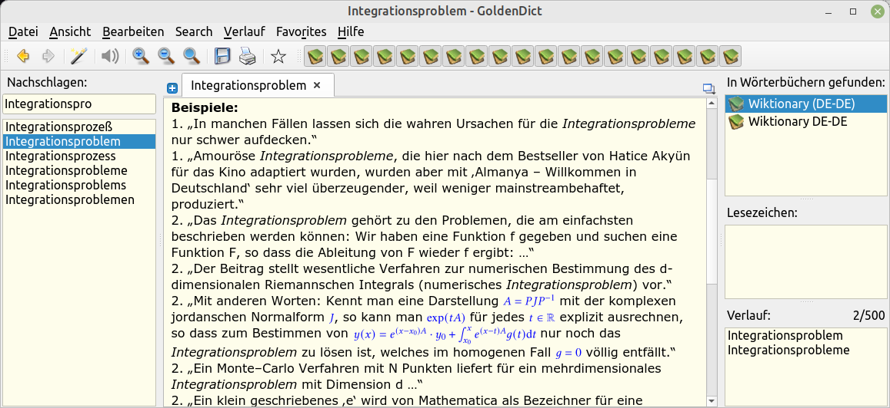
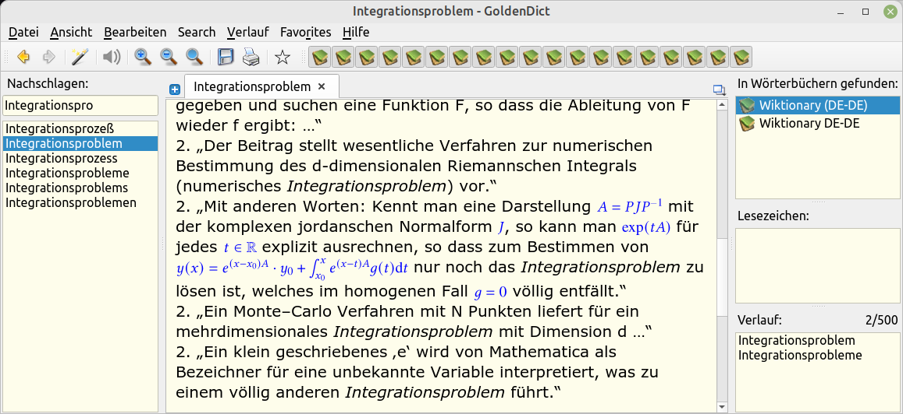
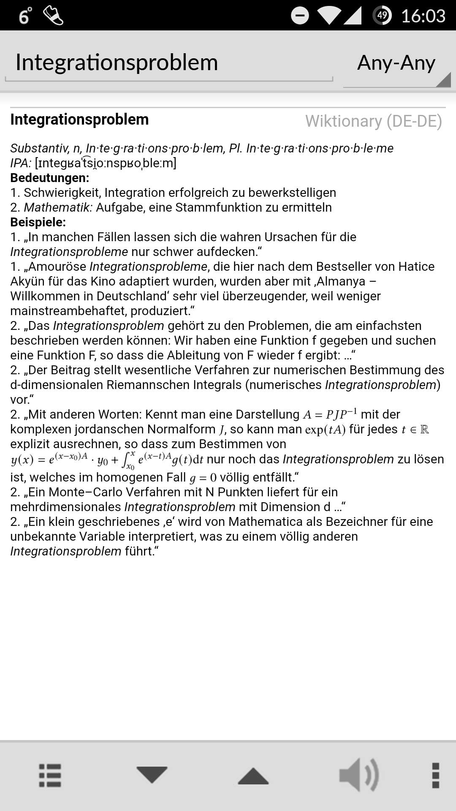
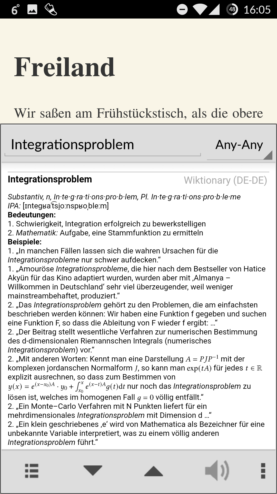
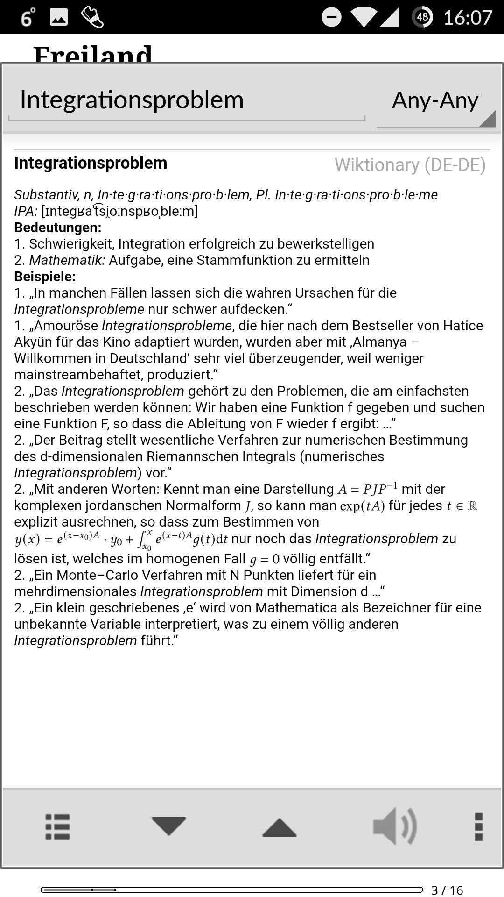
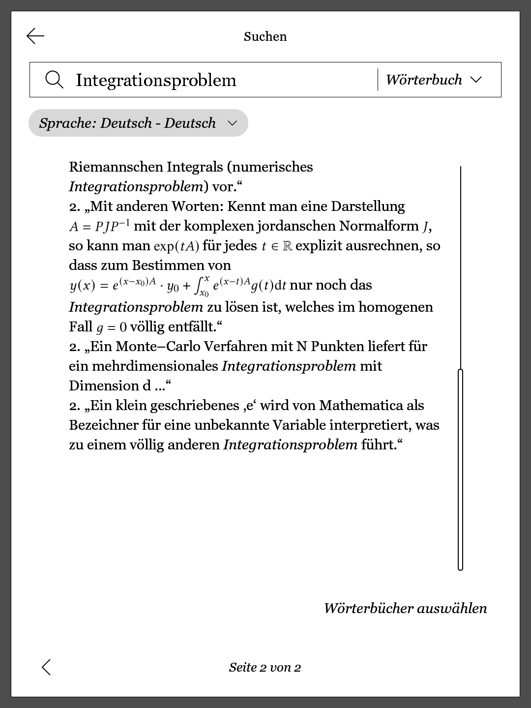

# `latex2svg` in Real Life

I used `latex2svg` for converting _LaTeX_ code in a [German Wiktionary](https://de.wiktionary.org/) dump,
to generate dictionaries for e-book readers. It contained 799,031 entries
with 339 formulas—all converted correctly into inline SVGs.

Conversion into the different e-reader dictionary formats was then done
using [_pyglossary_](https://github.com/ilius/pyglossary), producing _StarDict_ and _Kobo_-format dictionaries.

The following screenshots show some results, for ease of comparison always
looking up the word _Integrationsproblem_ in the dictionary.


## On Linux (StarDict)

I use some CSS in the GoldenDict theme here, to make formulae easily distinguishable:

```css
svg {
  fill: blue;
}
```





## On Android (StarDict)







## On a Kobo E-Reader (dicthtml)


